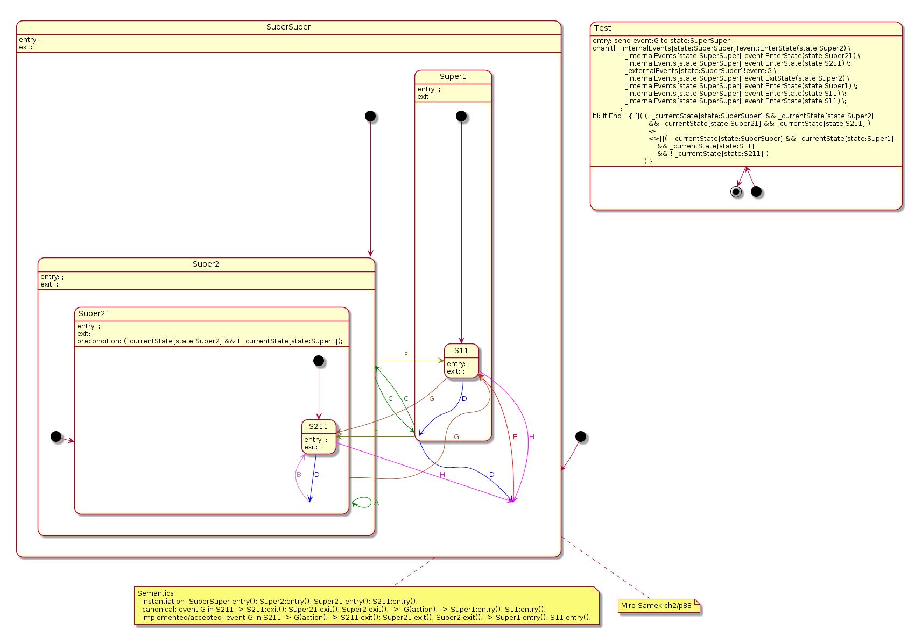

# upml - formal verification of UML state machines with Promela and TLA+/PlusCal



A tool to convert (a subset of the whole [spec](https://www.omg.org/spec/UML/2.5.1/PDF) of) a UML state machine/statechart into:

- a [Promela model](doc/upml/spin.md) for [spin](https://github.com/nimble-code/Spin) checking.
- a [TLA model](doc/upml/tla.md)

The state machine is described in a plantuml file (again, a subset of what plantuml offers) with some additions.

## Status

Finite state machines (FSM) should be fully supported. Hierarchical state machines (HSM) are WIP, and having only a Promela model.

## Build

Depends on boost (spirit, program_options, filesystem). Requires C++20 or later.

## upml documentation

- [Syntax](doc/upml/syntax.md)
- Examples:
  - [(FSM) A lamp switch](doc/upml/switch.md)
  - [(FSM) Some SIP stuff](doc/upml/sip.md)

## Similar tools & various links

- ```vUML```. I could not get my hands on it.
- [An exhaustive list of FSL](https://buttondown.email/hillelwayne/archive/formal-specification-languages/)
- [SysML](https://sysml.org/)
- [qhsmtst/qtools](https://www.state-machine.com/qtools/qutest_qhsm.html)
