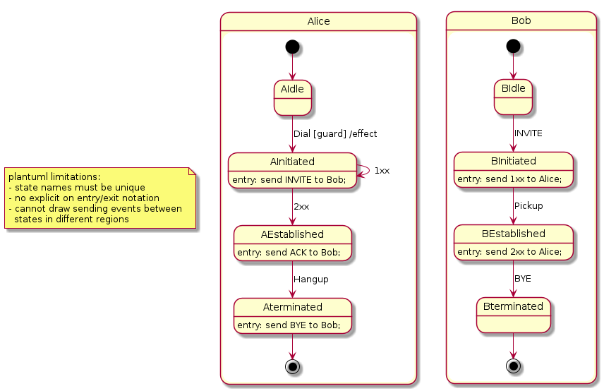

# upml - from plantuml to promela

A tool to convert a plantuml state machine to promela for [spin](https://github.com/nimble-code/Spin) checking.

WIP, nothing to see yet.

## Status

@see [the plantuml state diagram](https://plantuml.com/state-diagram):

- unsupported: history
- unsupported: fork, join
- idem: choice
- idem: entry/exit point
- idem: pin
- idem: expansion
- unsupported plantuml constructs:
  - state declarations such as:
    - ```state "long state name" as xxx``` 
    - ```state ignoredAgain as "long name"```
  - json
  - skinparam

Additions:
- comments: ```//```, ```/**/```. If you can, use note instead.
- transition: ```state --> state : event [guard]/effect```
- state actions: ```entry```, ```exit```
  - ```send``` event from state:
    ```entry: send INVITE to Bob;```

## Build

Depends on boost (spirit, program_options).

## Usage

Notes:
- each region executes in its own (promela) process.
- a state execute in the process/region that owns it unless it
  has multiple regions, in which case all its regions 
  are separate processes from the owning region.
- events are asynchronous messages. Event names are unique per 
  plantuml file.

To process this non-RFC3261-conformant-and-simplified [sip.plantuml](plantuml/sip.plantuml):


```
./upml --in ../plantuml/sip.plantuml --out ./sip.promela --dump ./sip.upmldmp

# or
cat ../plantuml/sip.plantuml | ./umpl > ./sip.promela

# see e.g. https://spinroot.com/spin/Man/Manual.html
spin -c ./sip.promela

# or
spin -a ./sip.promela
gcc -o pan pan.c
./pan -c0
...

```

