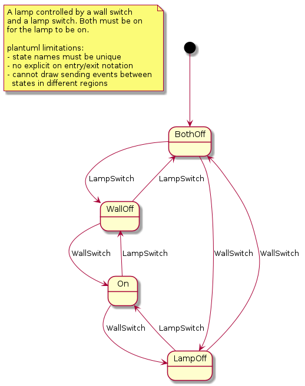

- [Install spin](#install-spin)
- [Usage](#usage)
  - [Cheat Sheet](#cheat-sheet)
  - [A lamp switch](#a-lamp-switch)
    - [Simulation](#simulation)
    - [Verification](#verification)
  - [SIP stuff](#sip-stuff)
    - [Simulation](#simulation-1)
    - [Verification](#verification-1)


## Install spin

```
sudo apt install spin
```
Note: this lacks xspin and other tools included in the distribution.

[comment]<details>
[comment]<summary>From source</summary>
From source:

```
git clone https://github.com/nimble-code/Spin.git
cd Spin
make # result: Src/spin

#xspin is under optional_gui/ispin.tcl
```
[comment]</details>

## Usage

Notes:
- there is at least one region in the state machine.
- each region executes in its own (promela) process.
- a composite state executes in its own region - it has at
  least one region.
- a simple state executes in the composite state/region 
  that owns it. 
- events are asynchronous messages. Event names are unique per 
  plantuml file.

### Cheat Sheet

(just use xspin/ispin.tcl)

```
# safety: assertions, non-reacheable code, race conditions
spin -a pmlfile
gcc -DSAFETY -o pan pan.c
./pan

# acceptance cycles
gcc -o pan pan.c
./pan -a

# non-progress cycles

gcc -DNP -o pan pan.c
./pan -l

```

### A lamp switch

A double (lamp & wall) switch lamp [switch.plantuml](plantuml/switch/switch.plantuml) model:


#### Simulation

Left as above, only interactive simulation is possible. A "human" can be added to randomly 
flip the switches; also wrap the switch spec into its own ```Switch``` composite state:

```
state Human {
  [*] --> Flip
  Flip: config: noInboundEvents;
  Flip --> Flip : NullEvent /send event:LampSwitch to state:Switch;
  Flip --> Flip : NullEvent /send event:WallSwitch to state:Switch;
}
```


```
./upml --in ../plantuml/switch/switch.plantuml --out ../plantuml/switch/switch.promela 

# or
cat ../plantuml/switch/switch.plantuml | ./umpl > ../plantuml/switch/switch.promela

# see e.g. https://spinroot.com/spin/Man/Manual.html
spin -c -u200 ../plantuml/switch/switch.promela

# or
spin -a ./sip.promela
gcc -o pan pan.c
./pan -c0 -u200
...
```

#### Verification

Use xspin/ispin.tcl.

### SIP stuff

A non-RFC3261-conformant-and-simplified [sip0.plantuml](plantuml/sip/sip0.plantuml) model:


#### Simulation

WIP

#### Verification

WIP

