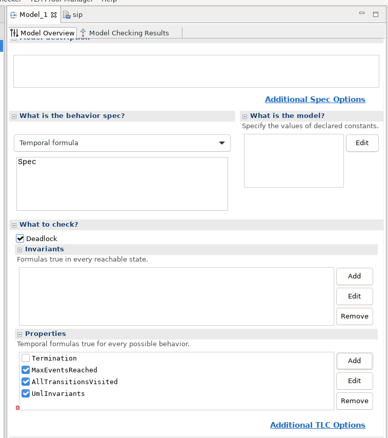

- [Install](#install)
- [Status](#status)
- [Model](#model)
- [Usage](#usage)
- [Cheat sheet](#cheat-sheet)
- [A lamp switch](#a-lamp-switch)
- [SIP stuff](#sip-stuff)
- [Varia](#varia)

## Install

- [with snap](https://snapcraft.io/tlaplus)
- from [github](https://github.com/tlaplus/tlaplus/releases)
  - fetch the gtk zip and maybe the latest tla2tools.jar
  - unzip in a folder
  - replace the jar if newer
  - run toolbox/toolbox
- install [tlapm](https://github.com/tlaplus/tlapm)
- fetch the command line [wrappers](https://github.com/pmer/tla-bin)

Alternative toolbox: [Apalache](https://apalache.informal.systems/)

## Status

A couple of hacks:

- The basic toolbox checks do not detect a transition that is never taken (and this could be a genuine logic error of the UML machine we are trying to model). I had to add an ```AllTransitionsVisited``` temporal property. This unreacheable code check comes for free with Promela and now I wonder what other checks have to be coded...
- I had to add an ```MaxEventsReached``` temporal property to limit infinite runs. This also comes (almost) for free with Promela. 
Adjust ```maxUmlEvents``` as needed and note it is a negative. I could have used a CONSTANT here but - ideally - all the artifacts are contained in the model file.

## Model

By and large the same as the [Promela](README.spin.md) one.

## Usage

Add ```MaxEventsReached```, ```AllTransitionsVisited```, ```UmlInvariants``` to the model: .

These would be under ```PROPERTY``` in the config file for the model.

## Cheat sheet

Command line (or use the tla-bin wrapper scripts above):
```
java -cp tla2tools.jar tla2sany.SANY -help  # The TLA⁺ parser
java -cp tla2tools.jar tlc2.TLC -help       # The TLA⁺ finite model checker
java -cp tla2tools.jar tlc2.REPL            # Enter the TLA⁺ REPL
java -cp tla2tools.jar pcal.trans -help     # The PlusCal-to-TLA⁺ translator
java -cp tla2tools.jar tla2tex.TLA -help    # The TLA⁺-to-LaTeX translator
```

Configuration file settings (to the best of my current knowledge):
```
ACTION_CONSTRAINT
ACTION_CONSTRAINTS
CONSTANT
CONSTANTS
CONSTRAINT
CONSTRAINTS
INIT
INVARIANT
INVARIANTS
PROPERTY
PROPERTIES
NEXT
SYMMETRY
TYPE
TYPE_CONSTRAINT
VIEW
```

## A lamp switch

Close the system as described in the [Promela](README.spin.md) page. Note: this will generate an infinite run (for now).

Then run upml and load the result in the toolbox:

```
./upml --in ../plantuml/switch/switch.plantuml --out ../plantuml/switch/switch.tla --backend tla
```

Adjust ```maxUmlEvents``` to something like ```-5```; ```MaxEventsReached``` will fire.

## SIP stuff

Close the system as described in the [Promela](README.spin.md) page, run upml:

```
./upml --in ../plantuml/sip/sip.plantuml --out ../plantuml/sip/sip.tla --backend tla
```
Then use the toolbox with e.g. Temporal Formula: Spec and a Deadlock check.

## Varia

- [Lamport](https://lamport.azurewebsites.net/tla/standalone-tools.html?back-link=tools.html)
- [All kinds of resources](https://learntla.com/reference/other-resources.html)
- [presentation & links](https://www.moritz.systems/blog/an-introduction-to-formal-verification/)

