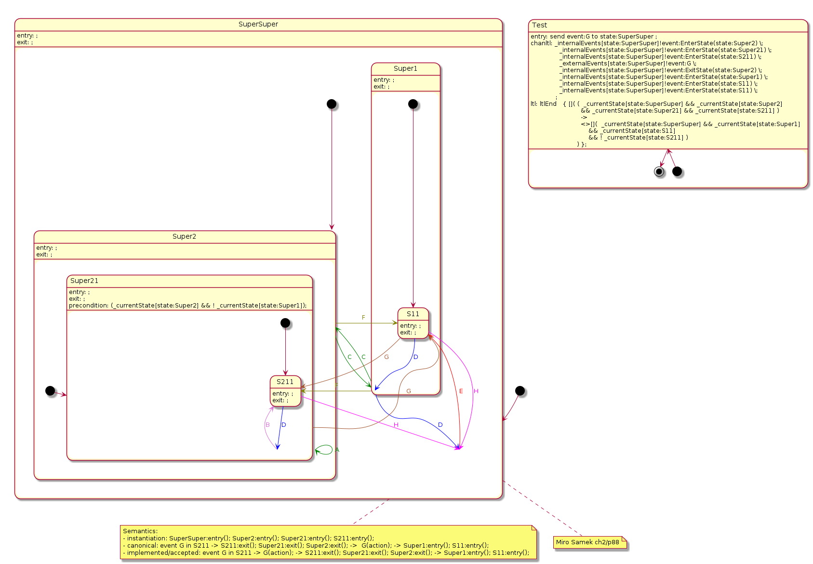

## (HSM) A take on Samek

Add a [test](../../plantuml/hsm/samek-g.plantuml) to inject an event into the the [Samek's](https://www.state-machine.com/psicc2) state machine:

```
--

state Test {
[*] --> Test
Test --> [*]

// Inject event
Test: entry: send event:G to state:SuperSuper ;

// Check end state         // Start state(s):
Test: ltl: ltlEnd   { []( (  _currentState[state:SuperSuper] && _currentState[state:Super2] \n\
                          && _currentState[state:Super21] && _currentState[state:S211] ) \n\
			  -> \n\
			  // End state(s)
                          <>[](  _currentState[state:SuperSuper] && _currentState[state:Super1] \n\
                              && _currentState[state:S11]) \n\
		       ) };
}
```

Then generate the Promela model:
```
./upml --in ../../plantuml/hsm/samek-g.plantuml --out ../../plantuml/hsm/samek-g.promelal --backend spin-hsm
```

Note the non-canonical execution order: transition action(s), state exit axctions, state enter actions.




