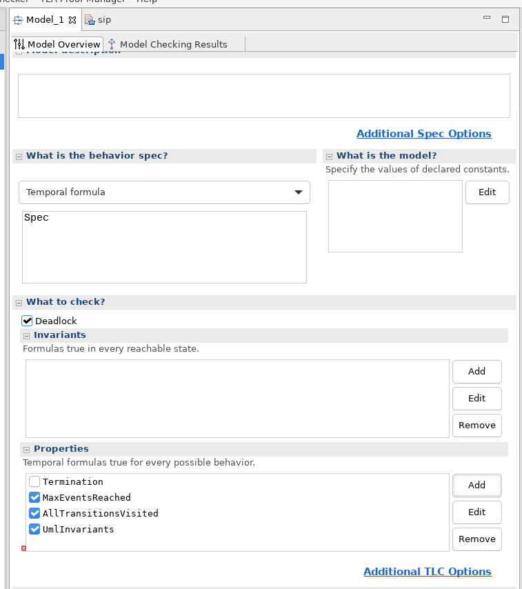

## (FSM) SIP stuff

A non-RFC3261-conformant-and-simplified [sip0.plantuml](../../plantuml/fsm/sip/sip0.plantuml) combination of two SM representing two parties bound by (a subset of the) SIP protocol:


## Promela 

### Simulation

Close the system with a "buggy" event generator. This generator can generate 
a) multiple events (e.g. Dial to Alice) as the spin machine moves through its 
intermediate states that do not change the SM states;
b) non-deterministically choose between multiple event possibilities as the 
spin machine moves through its intermediate states etc,etc:

```
state ClosedSystemEnvironment {
[*] --> EventGenerator 
EventGenerator: config: noInboundEvents;
EventGenerator --> EventGenerator : NullEvent [state:Alice:currentState == state:AIdle] /send event:Dial to state:Alice;
EventGenerator --> EventGenerator : NullEvent [state:Bob:currentState == state:BInitiated] /send event:Pickup to state:Bob;
EventGenerator --> EventGenerator : NullEvent [state:Alice:currentState == state:AEstablished] /send event:Hangup to state:Alice;
}
```
As a result, some simulations are good and some will timeout with the SM in some weird state.  Either
fix the issues exposed by spin in the abominable SM, either use a deterministic event generator with an LTL check:

```
state ClosedSystemEnvironment {
[*] --> AliceDial 
AliceDial: config: noInboundEvents;
AliceDial --> BobPickup : NullEvent [state:Alice:currentState == state:AIdle] /send event:Dial to state:Alice;

BobPickup: config: noInboundEvents;
BobPickup --> AliceHangup : NullEvent [state:Bob:currentState == state:BInitiated] /send event:Pickup to state:Bob;

AliceHangup: config: noInboundEvents;
AliceHangup --> CallEnded : NullEvent [state:Alice:currentState == state:AEstablished] /send event:Hangup to state:Alice;

CallEnded: config: noInboundEvents;
CallEnded --> [*]

ClosedSystemEnvironment: ltl: ltlFinalStates {<>[](state:ClosedSystemEnvironment:currentState == state:CallEnded && state:Alice:currentState == state:Aterminated && state:Bob:currentState == state:Bterminated)};
}
```


A good run:

```
spin -c -g -l -u200 ../plantuml/sip/sip.promela
proc 0 = :init:
proc 1 = region_r13
proc 2 = region_r3
proc 3 = region_r35
proc 4 = region_r4
q\p   0   1   2   3   4
  1   .   .   .   .   _channels[0]!event_Dial,11,3
  1   .   _channels[0]?event_Dial,11,3
          MSC: > 0 region_r13 event event_Dial in state 1
  3   .   _channels[2]!event_INVITE,2,8
  3   .   .   .   _channels[2]?event_INVITE,2,8
                  MSC: > 2 region_r35 event event_INVITE in state 6
  3   .   .   .   .   _channels[2]!event_Pickup,11,8
  1   .   .   .   _channels[0]!event_1xx,7,3
  1   .   _channels[0]?event_1xx,7,3
          MSC: > 0 region_r13 event event_1xx in state 2
  3   .   .   .   _channels[2]?event_Pickup,11,8
                  MSC: > 2 region_r35 event event_Pickup in state 7
  3   .   .   .   .   _channels[2]!event_Pickup,11,8
  1   .   .   .   _channels[0]!event_2xx,5,3
  1   .   _channels[0]?event_2xx,5,3
          MSC: > 0 region_r13 event event_2xx in state 2
  3   .   .   .   _channels[2]?event_Pickup,11,8
                  MSC: > 2 region_r35 event event_Pickup in state 5
  1   .   .   .   .   _channels[0]!event_Hangup,11,3
  3   .   _channels[2]!event_ACK,0,8
  1   .   _channels[0]?event_Hangup,11,3
          MSC: > 0 region_r13 event event_Hangup in state 0
  1   .   .   .   .   _channels[0]!event_Hangup,11,3
  3   .   _channels[2]!event_BYE,4,8
  1   .   _channels[0]?event_Hangup,11,3
          MSC: > 0 region_r13 event event_Hangup in state 4
      timeout

```

### Verification

Use ```ltl```, ```precondition```, ```postcondition```, ```invariant```.

(The plantuml file contains a few useless precondition, postcondition & invariant statements for demo and testing)

Use xspin/ispin.tcl.

## TLA

Close the system as described in the Promela section, run upml:

```
./upml --in ../plantuml/fsm/sip/sip.plantuml --out ../plantuml/fsm/sip/sip.tla --backend tla-fsm
```
Then use the toolbox with e.g. Temporal Formula: Spec and a Deadlock check.


