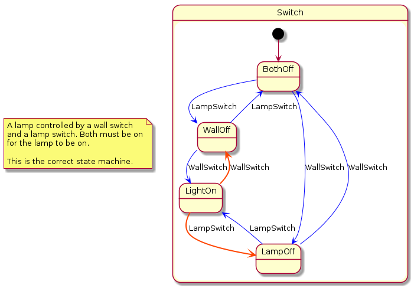

## A double switch  model

A double (lamp & wall) switch lamp [switch.plantuml](../../plantuml/switch/switch.plantuml) model:


## Promela 

### Simulation

Left as above, only interactive simulation is possible, if ever. 
A "human" must be added to randomly flip the switches - the state machine needs 
the "environment" in which it operates for simulation and verification; verification 
needs a fully-specified/closed system.

Then wrap the switch spec into its own ```Switch``` composite state:

```
state Human {
  [*] --> Flip
  Flip: config: noInboundEvents;
  Flip --> Flip : NullEvent /send event:LampSwitch to state:Switch;
  Flip --> Flip : NullEvent /send event:WallSwitch to state:Switch;
}
```


```
./upml --in ../plantuml/switch/switch.plantuml --out ../plantuml/switch/switch.promela --backend spin

# or
cat ../plantuml/switch/switch.plantuml | ./umpl > ../plantuml/switch/switch.promela

# see e.g. https://spinroot.com/spin/Man/Manual.html
spin -c -u200 ../plantuml/switch/switch.promela

# or
spin -a ./sip.promela
gcc -o pan pan.c
./pan -c0 -u200
...
```

```
spin -c -g -l -u200 ../plantuml/switch/switch.promela
proc 0 = :init:
proc 1 = region_r17
proc 2 = region_r19
proc 3 = region_r30
q\p   0   1   2   3
  3   .   .   _channels[2]!event_WallSwitch,1,5
  3   .   .   .   _channels[2]?event_WallSwitch,1,5
                  MSC: > 2 region_r30 event event_WallSwitch in state 0
  3   .   .   _channels[2]!event_WallSwitch,1,5
...

  3   .   .   .   _channels[2]?event_LampSwitch,1,5
                  MSC: > 2 region_r30 event event_LampSwitch in state 3
-------------
depth-limit (-u200 steps) reached
```

### Verification

Mark states as ```progressTag``` e.g. ```On: config: progressTag;``` for non-progress checks.
Use xspin/ispin.tcl.

## TLA

Close the system as described in the Promelasection above. Note: this will generate an infinite run (for now).

Then run upml and load the result in the toolbox:

```
./upml --in ../plantuml/switch/switch.plantuml --out ../plantuml/switch/switch.tla --backend tla
```

Adjust ```maxUmlEvents``` to something like ```-5```; ```MaxEventsReached``` will fire.


