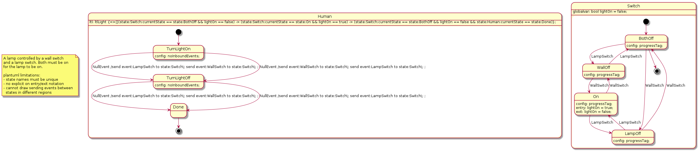

## A double switch  model

A double (lamp & wall) switch lamp [switch.plantuml](../../plantuml/switch/switch.plantuml) model:


## Promela 

The state machine needs an "environment" in which to operate for both simulation and verification; 
we need to put the statechart in a fully-specified/closed system.

### Simulation

Add a "human" to randomly flip the switches for an infinite number of times.

Then wrap the switch spec into its own ```Switch``` composite state:

```
state Human {
  [*] --> Flip
  Flip: config: noInboundEvents;
  Flip --> Flip : NullEvent /send event:LampSwitch to state:Switch;
  Flip --> Flip : NullEvent /send event:WallSwitch to state:Switch;
}
```

Generate the spec and run it:

```
./upml --in ../plantuml/switch/switch.plantuml --out ../plantuml/switch/switch.promela --backend spin

# or
cat ../plantuml/switch/switch.plantuml | ./umpl > ../plantuml/switch/switch.promela

# see e.g. https://spinroot.com/spin/Man/Manual.html
spin -c -u200 ../plantuml/switch/switch.promela

# or
spin -a ./sip.promela
gcc -o pan pan.c
./pan -c0 -u200
...
```

```
spin -c -g -l -u200 ../plantuml/switch/switch.promela
proc 0 = :init:
proc 1 = region_r17
proc 2 = region_r19
proc 3 = region_r30
q\p   0   1   2   3
  3   .   .   _channels[2]!event_WallSwitch,1,5
  3   .   .   .   _channels[2]?event_WallSwitch,1,5
                  MSC: > 2 region_r30 event event_WallSwitch in state 0
  3   .   .   _channels[2]!event_WallSwitch,1,5
...

  3   .   .   .   _channels[2]?event_LampSwitch,1,5
                  MSC: > 2 region_r30 event event_LampSwitch in state 3
-------------
depth-limit (-u200 steps) reached
```

### Verification



- add a "Human" to flip the switches to turn the light on then to turn it back off. This should get the SM back into
the ```BothOff``` state.
- mark ```BothOff``` as the final state for this scenario otherwise an invalid end state error will be reported
- add a ```lightOn``` ghost variable
- write the LTL accordingly


```
state Human {

[*] --> TurnLightOn
TurnLightOn: config: noInboundEvents;
TurnLightOn --> TurnLightOff : NullEvent /send event:LampSwitch to state:Switch\; send event:WallSwitch to state:Switch\; ;
TurnLightOn --> TurnLightOff : NullEvent /send event:WallSwitch to state:Switch\; send event:LampSwitch to state:Switch\; ;

TurnLightOff: config: noInboundEvents;
TurnLightOff --> Done : NullEvent /send event:LampSwitch to state:Switch\; send event:WallSwitch to state:Switch\; ;
TurnLightOff --> Done : NullEvent /send event:WallSwitch to state:Switch\; send event:LampSwitch to state:Switch\; ;

Done --> [*]

Human: ltl: ltlLight {<>[](state:Switch:currentState == state:BothOff && lightOn == false) -> (state:Switch:currentState == state:On && lightOn == true) -> (state:Switch:currentState == state:BothOff && lightOn == false && state:Human:currentState == state:Done)};
}

state Switch {

Switch: globalvar: bool lightOn = false;

[*] --> BothOff
BothOff: config: progressTag;
BothOff --> WallOff : LampSwitch
BothOff --> LampOff : WallSwitch
BothOff --> [*]

WallOff: config: progressTag;
WallOff --> On : WallSwitch
WallOff --> BothOff : LampSwitch

LampOff --> BothOff : WallSwitch
LampOff --> On : LampSwitch
LampOff: config: progressTag;

On --> WallOff : WallSwitch
On --> LampOff : LampSwitch
On: config: progressTag;
On:entry: lightOn = true;
On:exit: lightOn = false;

}

```

Use xspin/ispin.tcl.


## TLA

Close the system as described in the Promela section above. Note: this might generate an infinite run (as in the first/simulation closed system).

Then run upml and load the result in the toolbox:

```
./upml --in ../plantuml/switch/switch.plantuml --out ../plantuml/switch/switch.tla --backend tla
```

Adjust ```maxUmlEvents``` to something like ```-5```; ```MaxEventsReached``` will fire.


