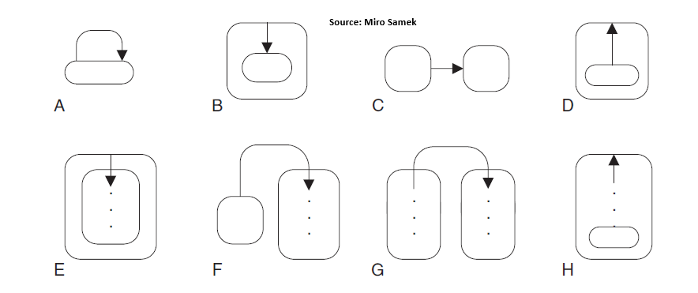

# UML

- A: self transition: exit, exec transition, re-enter
- B: source == super(target): exec transition, enter target
- C: super(source) == super(target)
- D: super(source) == target: exec transition, enter super. **No exit from source (!!)**
- E: see B. No exit from source
- F: exit source, exec transition, enter target hierarchy
- G: xit source hierarchy, exec transition, enter target hierarchy
- H: see D
